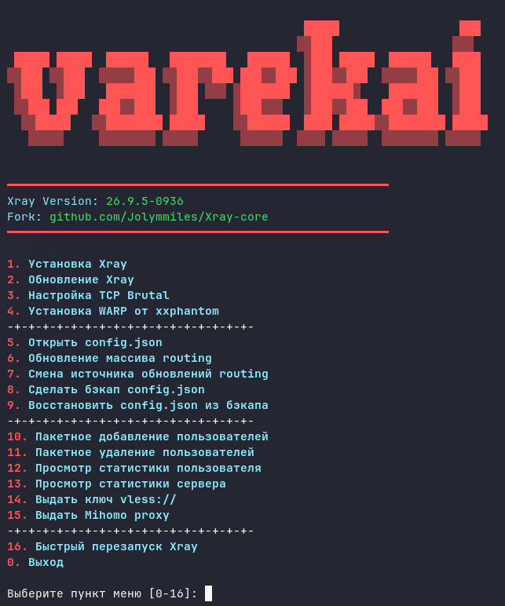

# Varekai

Интерактивный bash-скрипт развёртывания и управления форком Xray от **Jolymmiles**, предполагающий работу в качестве self-steal реверс-прокси

### Требования

0. Ubuntu **до 24.04** / любой Debian
1. Свой домен
2. Знание документации Xray

### Особенности

- Ядро: [Jolymmiles/Xray-core](https://github.com/Jolymmiles/Xray-core) c встроенной поддержкой mihomo-совместимого мультиплексирования **SMUX** и **H2MUX**
- Удобное обновление ядра с выбором конкретной версии для установки
- Установка модуля ядра Linux TCP Brutal
- Автоматическая установка WARP от [xxphantom/docker-warp-native](https://github.com/xxphantom/docker-warp-native). при установке Xray
- Возможность обновления правил серверного роутинга из удалённого источника по raw-ссылке
- Удобная работа с бэкапами конфига Xray
- Пакетное добавление / удаление пользователей
- Просмотр статистики по пользователю / всей ноде
- Удобная генерация ключей vless://
- Удобная генерация mihomo proxy
- В серверном роутинге уже заблокированы ресурсы, подключение к которым могло бы скомпрометировать ноду

## Установка

```bash
curl -sL https://raw.githubusercontent.com/vrzdrb/varekai/main/varekai.sh -o varekai.sh
chmod +x varekai.sh
sudo ./varekai.sh
